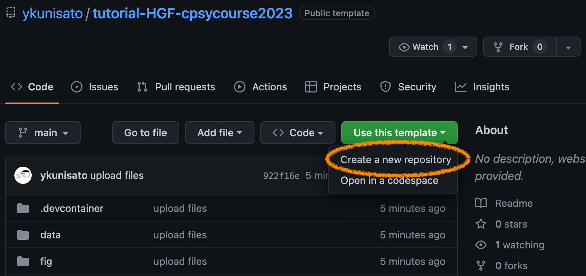
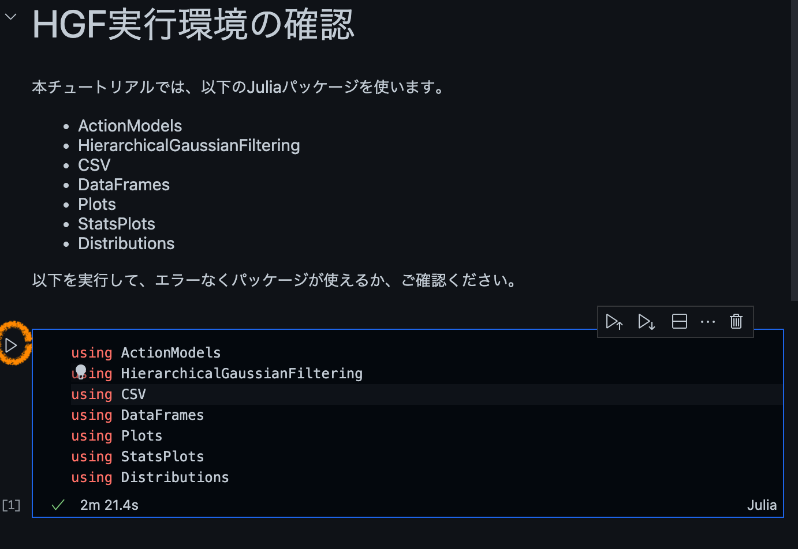

# CPSYコース東京2023 HGFチュートリアル

## はじめに

このリポジトリは、「CPSYコース東京2023」のHGFチュートリアル資料置き場です。

- [HGFモデルの基礎（Mathys et al., 2014）](equations_HGF.md)
- [必要なJuliaパッケージがインストールされているか確認する](01_check_HGF.ipynb)
- [入力が連続の場合のHGF](02_continuous.ipynb)
- [入力が２値の場合のHGF](03_binary.ipynb)

## このリポジトリにあるコードの実行方法

このリポジトリの実行方法としては、(1)GithubのCodespaces上での実行、(2)ご自身のPCでDockerを使って環境を構築して実行、(3)ご自身のPCでJulia環境とパッケージを手動で構築して実行の３つがあります。再現性のある実行環境の準備は難しいので、(1)を推奨しますが、Dockerに慣れている方は(2)の方がマシンパワーが強いと思われるので、良いかもしれません。

### (1)GithubのCodespaces上で実行する

GitHubは、クラウド開発環境の[Codespaces](https://github.co.jp/features/codespaces)を用意しています。2023年2月においては、無料アカウントに月120コア時間＆15GBのストレージがついてきます。ちょっとした確認などの場合は、Codespacesで解析環境を試すのが便利になってきています（数分で環境が整います）。まず、Githubアカウントを作成しましょう。

#### このリポジトリをご自身のリポジトリにコピーする

「Use this template」の下向き三角をクリックしてください。


「Create a new repository」をクリックします。



「Repository name」にお好きな名前を英語で記入して、「Private」を選択します（他の方に見られても問題ない場合は、Publicでも良いです）。「Create repository from template」をクリックします。


以下のように、ご自身のアカウント内に、このリポジトリがコピーされました。


#### Codespacesを立ち上げる

このリポジトリ内の.devcontainer内に使用するDockerイメージなどの情報が入っており、Codespacesを立ち上げれば自動的にそれらが反映されます。

「Code」の下向き三角をクリックして、Codespacesタブを選びます。「Create codespaces on main」をクリックします。


以下のような画面になって、イメージのダウンロードなどが始まります。そのまま放置してもいいですが、「View logs」をクリックすると、その様子が確認できます。


放置したままにしていますと、以下のような画面が立ち上がります。最初に準備があるので（画面が動くのでなんとなくわかると思います）、落ち着くまで放置します。


立ち上がったら、左のEXPLORERから「01_check_HGF.ipynb」をクリックして開きます。


ちゃんと解析環境が整っているか(Juliaが動作するか、パッケージが入っているか)確認するため、左端の右向き三角をクリックします。以下の図のように、下に緑のチェックマークが出ていたら、正常に動作しています（なお、初回の動作には時間がかかります）。



#### 作業が終わったらCodespacesを削除する

Codespacesは立ち上げっぱなしだと、CPU時間とストレージを消費します。しばらく操作しない場合は、その都度、Codespacesを削除するのが良いです（CodespacesをStopしてもストレージの消費は続きます）。「Code」->「Codespaces」->Active横の・・・->「Delete」をクリックする。


Codespacesの削除は少し違和感あるかもしれないのですが（せっかく準備したのに・・・）、削除しても立ち上げに毎回数分程度しかかかりません。

### (2)ローカルPCで実行する
#### Dockerの用意

ご自身のPCにDockerを用意ください。Windowsの場合は、少し工夫が必要になります。普段からDockerを使っておられない場合は、Codespacesの利用をお勧めします。

#### hgfイメージを準備して実行

[hgf用イメージ](https://github.com/ykunisato/ghcr-hgf/pkgs/container/hgf)を作成しました。それぞれのローカルPCに合わせて以下のコマンドを実行ください。

- Mac(Intel)の場合

Terminalで以下を実行します。

```
docker run -d --name notebook -v `pwd`:/home/jovyan/work -p 8888:8888 -e JUPYTER_ENABLE_LAB=yes ghcr.io/ykunisato/hgf:1.8.5 start-notebook.sh --NotebookApp.token="token that you set"
```

- Mac(Apple Silicon)の場合

Terminalで以下を実行します。

```
docker run -d --name notebook -v `pwd`:/home/jovyan/work -p 8888:8888 -e JUPYTER_ENABLE_LAB=yes ghcr.io/ykunisato/hgf:1.8.5.arm start-notebook.sh --NotebookApp.token="token that you set"
```

- Windowsの場合

コマンドプロンプトで以下を実行します。

```
docker run -d --name notebook -v "%cd%":/home/jovyan/work -p 8888:8888 -e JUPYTER_ENABLE_LAB=yes ghcr.io/ykunisato/hgf:1.8.5 start-notebook.sh --NotebookApp.token="token that you set"
```

イメージのプルや実行が済んだら、ブラウザに "http://localhost:8888/" を打ち込んで必要パッケージの用意されたJupyter環境にアクセスください。


