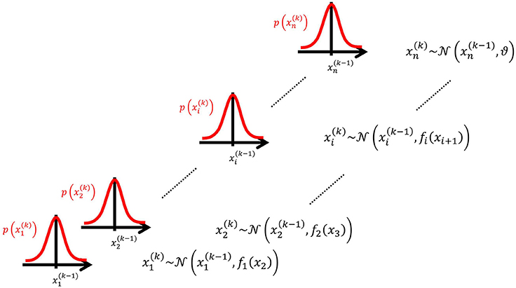

# HGF

[Mathys CD, Lomakina EI, Daunizeau J, Iglesias S, Brodersen KH, Friston KJ and Stephan KE (2014) Uncertainty in perception and the Hierarchical Gaussian Filter. Front. Hum. Neurosci. 8:825. doi: 10.3389/fnhum.2014.00825](https://www.frontiersin.org/articles/10.3389/fnhum.2014.00825/full)

HGFは，エージェントが連続的で不確実な量（確率変数） $x$ の動きをどのように学ぶのかをモデル化している。
この動きを表す１つの一般的な方法としては，以下のガウシアンランダムウォークがある（Mathys et al.(2014) Equation 1）。
 $k$ は時間のインデックスで， $x^{(k-1)}$ が正規分布の平均 $\vartheta$ が正規分布の分散である。
 $x$ のvolatility(変動性)は， $\vartheta$ によって制御される（Mathys et al.(2014)は，変動性を時間単位あたりの時系列の分散としている）。

$$
x^{(k)} \sim \mathcal{N}\left(x^{(k-1)}, \vartheta\right), k=1,2, \ldots
$$

Equation 1では， $\vartheta$ を定数としているが，変動する可能性もある。そこで，あらたな確率変数の $x_{2}$ の関数として表現する(Mathys et al.(2014) Equation 2)。
Equation 2では， $x$ を $x_{1}$ としている。

$$
x_{1}^{(k)} \sim \mathcal{N}\left(x_{1}^{(k-1)}, f\left(x_{2}\right)\right)
$$

 $x_{2}$ は，関数にいれて $x_{1}$ の $\vartheta$ になる。以下の図のように高次の $x$ を低次の $x$ の分散にいれる形でいくらでも高次にできる。

各レベルiにおいて，次の高次のi+1との連結は，positive関数 $f_{i}\left(x_{i+1}\right)$ によってなされる。それは，分散もしくはランダムウォークのステップサイズとして表現される（Mathys et al.(2014) Equation 3）。

$$
x_{i}^{(k)} \sim \mathcal{N}\left(x_{i}^{(k-1)}, f_{i}\left(x_{i+1}\right)\right), i=1, \ldots, n-1
$$

最上位の階層では，関数の代わりに $\vartheta$ を用いる（Mathys et al.(2014) Equation 4）。

$$
x_{n}^{(k)} \sim \mathcal{N}\left(x_{n}^{(k-1)}, \vartheta\right), \vartheta>0
$$

$f_{i}$ を定義する必要があるが，positiveかつ解析的な関数を許容し，一次まで累乗展開して簡単な関数形式を与えることで出来る。しかし， $f_{i}$ はpositiveでないといけないので，直接展開することで近似はできない。
代わりに，わかりやすくするために指数を削除し，その対数を展開する（Mathys et al.(2014) Equation 5）。このシンプルな結合の形式は，平均場近似を使うことで，シンプルな１ステップ更新式を導出できるというメリットもある。

$$
f_{i}\left(x_{i+1}\right) \stackrel{\text { def }}{=} \exp \left(\kappa_{i} x_{i+1}+\omega_{i}\right)
$$

### Mathys et al.(2014) 付録A

付録Aでは，なぜ，Mathys et al.(2014) Equation 5になるのかを説明している。 $f(x)$  は，positive関数なので，以下のように $g(x)$ を指数関数にいれる（Mathys et al.(2014) Equation A1）

$$
f(x)>0 \forall x \Longrightarrow \exists g: f(x)=\exp (g(x)) \forall x
$$

$g(x)$ をテイラー展開していくと，以下のように整理できる（Mathys et al.(2014) Equation A2とA3）。展開した際に，２次以上の項を無視すると，HGFは１次の結合関数になる（そして， $ｘ$ の変動が小さい場合ならこれは問題にならない）。

$$
\begin{aligned}
& g(x)=g(a)+g^{\prime}(a) \cdot(x-a)+O(2)=\log f(x)= \\
& =\log f(a)+\frac{f^{\prime}(a)}{f(a)} \cdot(x-a)+O(2)= \\
& =\underbrace{\frac{f^{\prime}(a)}{f(a)}}_{\text {def }_\kappa} \cdot \underbrace{=}_{\text {def }} \omega=\underbrace{\log f(a)-a \cdot \frac{f^{\prime}(a)}{f(a)}}+O(2)= \\
& =\kappa x+\omega+O(2) \\
& \Longrightarrow \quad f(x) \approx \exp (\kappa x+\omega) \\
&
\end{aligned}
$$

入力 $u^{(k)}$ が以下のガウス放出分布（Gaussian emission distribution）によって生成されるとする（Mathys et al.(2014) Equation 6）。 $\widehat{\pi}$ は，放出分布の精度になる。Equation 3や5によって定義されたモデルは, $x^{(k)}_{1}$ のオンライン予測に使われる（つまりフィルタリングをしている）。モデルは階層的なガウスランダムウォークから構成されているので，HGFと呼ぶ。

$$
u^{(k)} \sim \mathcal{N}\left(x_{1}^{(k)}, \widehat{\pi}_{u}^{-1}\right)
$$

金融データの時系列を想像するとわかりやすい。 $u$ は，特定の証券の観測されたリターンである。 $x$ は，その潜在的な量である（真のリターンは，観測ノイズ $\widehat{\pi}$ がフィルターアウトされたもの）。 $\omega$ は，  $x$ の（対数）変動性のtonic(時間不変)な部分であり， $\kappa$ はphasic（時間変動）な部分である。こんな感じで変動性を階層的に扱うことができる（変動性の変動性が扱える）。

## 不規則な間隔の感覚入力のための近似的な逆変換

感覚入力(u)は、不規則な間隔でくるので、すべての階層のランダムウォークの分散に $u^{(k-1)}$ と $u^{(k)}$ の間の経過時間 $t^{(k)}$ を掛けたものをいれる(Mathys et al.(2014) Equation 7)。経過時間が一定なら、 $t^{(k)}$ は１に設定できる。

$$
x_{i}^{(k)} \sim \mathcal{N}\left(x_{i}^{(k-1)}, t^{(k)} f_{i}\left(x_{i+1}\right)\right), i=1, \ldots, n-1
$$

Mathys et al. (2011)で導入された変分法で、更新式を導出できる。まず、この近似では、ガウス事後分布が $\mu_{i}$ と $\pi_{i}$ をもつ（Mathys et al.(2014) Equation 8）。 

$$
x_{i}^{(k)} \mid u^{(1)}, \ldots, u^{(k)}, \chi \sim \mathcal{N}\left(\mu_{i}^{(k)},\left(\pi_{i}^{(k)}\right)^{-1}\right)
$$

なお、 $\chi$ は以下のように定義される。

$$
\chi \stackrel{\text { def }}{=}{\lbrace\kappa, \omega, \ldots, \kappa_{n-1}, \omega_{n-1}, \vartheta\rbrace}
$$

真の事後分布はガウス型からは多少外れるため、近似になる。十分統計量 $\mu_{i}$ と $\pi_{i}$ は、以下の更新式を使って、新しい入力uが入った後で更新される（Mathys et al.(2014) Equation 9-10）。

$$
\mu_{i}^{(k)}=\widehat{\mu}_{i}^{(k)}+\frac{1}{2} \kappa_{i-1} v_{i-1}^{(k)} \frac{\widehat{\pi}_{i-1}^{(k)}}{\pi_{i}^{(k)}} \delta_{i-1}^{(k)}
$$

$$
\begin{aligned} \pi_{i}^{(k)}= & \widehat{\pi}_{i}^{(k)}+\frac{1}{2}\left(\kappa_{i-1} v_{i-1}^{(k)} \widehat{\pi}_{i-1}^{(k)}\right)^{2} \left(1+\left(1-\frac{1}{v_{i-1}^{(k)} \pi_{i-1}^{(k-1)}}\right) \delta_{i-1}^{(k)}\right)\end{aligned}
$$

定義は以下の通り（Mathys et al.(2014) Equation 11-14）。分散は精度の逆数である。入力の不規則な間隔は、Equation 11の $t^{(k)}$ によって完全に説明されることに注意が必要である。

$$
\widehat{\mu}_{i}^{(k)} \stackrel{\text { def }}{=} \mu_{i}^{(k-1)}
$$

$$
\widehat{\pi}_{i}^{(k)} \stackrel{\text { def }}{=} \frac{1}{\sigma_{i}^{(k-1)}+v_{i}^{(k)}}
$$

$$
\delta_{i}^{(k)} \stackrel{\mathrm{def}}{=} \frac{\sigma_{i}^{(k)}+\left(\mu_{i}^{(k)}-\widehat{\mu}_{i}^{(k)}\right)^{2}}{\sigma_{i}^{(k-1)}+v_{i}^{(k)}}-1
$$

iが1からn-1の場合

$$
v_{i}^{k} \stackrel{\text { def }}{=}\mathrm{t}^{(\mathrm{k})} \exp \left(\kappa_{i} \mu_{\mathrm{i}+1}^{(\mathrm{k}-1)}+\omega_{\mathrm{i}}\right)
$$

i=nの場合

$$
v_{i}^{k} \stackrel{\text { def }}{=}\mathrm{t}^{(\mathrm{k})} \vartheta
$$

Equation9と10は、第２レベル以上の場合であり、第１レベルでは以下を用いる(Mathys et al.(2014) Equation 15-16)。

$$
\mu_{1}^{(k)}=\widehat{\mu}_{1}^{(k)}+\frac{\widehat{\pi}_{u}}{\pi_{1}^{(k)}} \delta_{u}^{(k)}
$$

$$
\pi_{1}^{(k)}=\widehat{\pi}_{1}^{(k)}+\widehat{\pi}_{u}
$$

定義は以下である(Mathys et al.(2014) Equation 17)。

$$
\delta_{u}^{(k)} \stackrel{\text { def }}{=} u^{(k)}-\widehat{\mu}_{1}^{(k)}
$$

 $\hat{\mu}$ と  $\hat{\pi}$ は、Equation 12と13で定義される。第１レベルでは、推論の方向が $u$ から $x_{1}$ に向かうので、それはEquation 6の平均である。一方、より高次のレベルでは、 $x_{i}$ から $x_{i+1}$ の方向に向かうので、Equation 3の分散になる。そのため、更新に用いる予測誤差が変わってくる。第１レベルではvalue prediction errors (VAPEs) だが、高次のレベルでは volatility prediction errors (VOPEs)になる。
 
最初のレベルでは、推論の方向が $u$ から $x_{1}$ までであり、これは式6のガウスの平均に現れるが、それ以上のレベルでは、推論の方向が $x_{i}$ から $x_{i+1}$ までであり、これは式3のガウスの分散に現れるからである。この結果、更新は異なる種類の予測誤差によって駆動されることになります：最初のレベルでは値予測誤差（VAPEs）、すべての高いレベルではボラティリティ（すなわち分散）予測誤差（VOPEs）です。この区別については、後述の「考察」で詳しく説明する。

### Mathys et al.(2014)の付録B

環境の状態についてのエージェントの信念を記述する上で十分統計量を更新する、「閉形式」で「１ステップ」更新式を、変分推定で求める。

１より上のレベルでは、平均場近似が用いられる。他のレベルの分布 $q(x_{j})$ は、既知のガウス型（既知の十分統計量（平均と分散）で記述できる）を想定する（Mathys et al.(2014) Equation B1）。

$$
q\left(x_j\right)=\mathcal{N}\left(x_j ; \mu_j, \sigma_j\right)
$$

時点kでレベルiにおいて $\mu_{1}^{(1)}$ から $\mu_{k}^{(1)}$ の入力を与えられた時の $\hat{q}(x_i^{(k)})$ の近似事後分布は、以下になる(Mathys et al.(2014) Equation B2)。

$$
\hat{q}\left(x_i^{(k)}\right)=\frac{1}{\mathcal{Z}_i^{(k)}} \exp \left(I\left(x_i^{(k)}\right)\right)
$$

上の式は、一般的な正規分布の確率密度関数 $\frac{1}{\sqrt{2 \pi \sigma^2}} \exp \left(-\frac{(x-\mu)^2}{2 \sigma^2}\right)$ を変分エネルギーIを用いて表現していると言える。変分エネルギーIの定義などは以下である（Mathys et al.(2014) Equation B3）。変分エネルギーIは、パラメータが互いに独立しているという仮定をおいた平均場近似で求める。q()とp()の距離が最小になるパラメータを求める。

$$
\begin{aligned}
I\left(x_i^{(k)}\right) & =\int q\left(x_{\backslash i}^{(k)}\right) \ln p\left(x_i^{(k)}, x_{\backslash i}^{(k)}, \chi \mid \mu_1^{(1 \ldots k)}\right) \mathrm{d} x_{\backslash i}^{(k)}, \\
q\left(x_{\backslash i}^{(k)}\right) & =\prod_{j \neq i} q\left(x_j\right), \\
x_{\backslash i} & =\left\{x_j\right\}_{j \neq i}, \\
\chi & =\left\{\kappa_i, \omega_i, \vartheta\right\}_{1<i<n} .
\end{aligned}
$$

変分エネルギー内をさらに整理すると以下になる(Mathys et al.(2014) Equation B4)。

$$
\begin{aligned}
p\left(x_i^{(k)}, x_{\backslash i}^{(k)}, \chi \mid \mu_1^{(1 \ldots k)}\right) & =\int \prod_{j=1}^n p\left(x_j^{(k)} \mid x_j^{(k-1)}, x_V^{(k)}, \chi\right) p\left(x_j^{(k-1)} \mid \mu_1^{(1 \ldots k-1)}\right) \mathrm{d} x_j^{(k-1)} \\
p\left(x_j^{(k)} \mid x_j^{(k-1)}, x_{\downarrow j}^{(k)}, \chi\right) & =\mathcal{N}\left(x_j^{(k)} ; x_j^{(k-1)}, t^{(k)} \exp \left(\kappa_j x_{j+1}^{(k)}+\omega_j\right)\right) \\
p\left(x_j^{(k-1)} \mid \mu_1^{(1 \ldots k-1)}\right) & =\mathcal{N}\left(x_j^{(k-1)} ; \mu_j^{(k-1)}, \sigma_j^{(k-1)}\right)
\end{aligned}
$$

積分をとると、以下になる(Mathys et al.(2014) Equation B5)。一番上のレベルでは小文字のシータ $\vartheta$ が出てくる（パラメータは、 $\kappa_i$ , $\omega_i$ , $\vartheta$ の３つである）。これは更新の予測ステップになる（ランダムウォークによって前の時点からのすべての状態が積分され、平均場近似を現在の状態に適用できるようになっている。カルマンフィルターと同じで、１つ前までの入力が与えられたときの $x_{i}^{k}$ の予測密度を提供する）。

$$
\begin{aligned}
p\left(x_i^{(k)}, x_{\backslash i}^{(k)}, \chi \mid \mu_1^{(1 \ldots k)}\right)= & \prod_{j=1}^n \mathcal{N}\left(x_j^{(k)} ; \mu_j^{(k-1)}, \sigma_j^{(k-1)}+t^{(k)} \exp \left(\kappa_j x_{j+1}^{(k)}+\omega_j\right)\right) \\
& \exp \left(\kappa_n x_{n+1}^{(k)}+\omega_n\right) \equiv \vartheta
\end{aligned}
$$

ようやく、変分エネルギー（B3）の式の積分を解くことができる（Mathys et al.(2014) Equation B6）。これについては、付録Cを参照する。

$$
\begin{aligned}
I\left(x_i^{(k)}\right)= & -\frac{1}{2} \ln \left(\sigma_{i-1}^{(k-1)}+t^{(k)} \exp \left(\kappa_{i-1} x_i^{(k)}+\omega_{i-1}\right)\right) \\
& -\frac{1}{2} \frac{\sigma_{i-1}^{(k)}+\left(\mu_{i-1}^{(k)}-\mu_{i-1}^{(k-1)}\right)^2}{\sigma_{i-1}^{(k-1)}+t^{(k)} \exp \left(\kappa_{i-1} x_i^{(k)}+\omega_{i-1}\right)} \\
& -\frac{1}{2} \frac{1}{\sigma_i^{(k-1)}+t^{(k)} \exp \left(\kappa_i \mu_{i+1}^{(k-1)}+\omega_i\right)}\left(x_i^{(k)}-\mu_i^{(k-1)}\right)^2
\end{aligned}
$$

[Mathys et al.(2011)](https://www.frontiersin.org/articles/10.3389/fnhum.2011.00039/full)の手順にしたがって、ガウス事後分布の平均と精度を以下のように計算できる。2重プライム(’’)は２次導関数、１重プライムは１次導関数である（Mathys et al.(2014) Equation B7 B8）。これらがEquationの9と10になる。

$$
\begin{aligned}
\pi_i^{(k)} & =-I^{\prime \prime}\left(\widehat{\mu}_i^{(k)}\right) \\
\mu_i^{(k)} & =\widehat{\mu}_i^{(k)}+\frac{1}{\pi_i^{(k)}} I^{\prime}\left(\widehat{\mu}_i^{(k)}\right),
\end{aligned}
$$

### Mathys et al.(2014)の付録C

B5式をB3式に代入すると以下になる(Mathys et al.(2014) Equation C1)。

$$
\begin{aligned}
I\left(x_i^{(k)}\right) & =\int q\left(x_{\backslash i}^{(k)}\right) \ln p\left(x_i^{(k)}, x_{\backslash i}^{(k)}, \chi \mid \mu_1^{(1 \ldots k)}\right) \mathrm{d} x_{\backslash i}^{(k)} \\
& =\int q\left(x_{\backslash i}^{(k)}\right) \ln \left(\prod_{j=1}^n \mathcal{N}\left(x_j^{(k)} ; \mu_j^{(k-1)}, \sigma_j^{(k-1)}+\exp \left(\kappa_j x_{j+1}^{(k)}+\omega_j\right)\right)\right) \mathrm{d} x_{\backslash i}^{(k)} \\
& =\sum_{j=1}^n \int q\left(x_{\backslash i}^{(k)}\right) \ln \mathcal{N}\left(x_j^{(k)} ; \mu_j^{(k-1)}, \sigma_j^{(k-1)}+\exp \left(\kappa_j x_{j+1}^{(k)}+\omega_j\right)\right) \mathrm{d} x_{\backslash i}^{(k)} \\
& =\int q\left(x_{\backslash i}^{(k)}\right) \ln \mathcal{N}\left(x_{i-1}^{(k)} ; \mu_{i-1}^{(k-1)}, \sigma_{i-1}^{(k-1)}+\exp \left(\kappa_{i-1} x_i^{(k)}+\omega_{i-1}\right)\right) \mathrm{d} x_{\backslash i}^{(k)}\\
&+\int q\left(x_{\backslash i}^{(k)}\right) \ln \mathcal{N}\left(x_i^{(k)} ; \mu_i^{(k-1)}, \sigma_i^{(k-1)}+\exp \left(\kappa_i x_{i+1}^{(k)}+\omega_i\right)\right) \mathrm{d} x_{\backslash i}^{(k)}+\text { const. } \\
= & \int q\left(x_{i-1}^{(k)}\right) \ln \mathcal{N}\left(x_{i-1}^{(k)} ; \mu_{i-1}^{(k-1)}, \sigma_{i-1}^{(k-1)}+\exp \left(\kappa_{i-1} x_i^{(k)}+\omega_{i-1}\right)\right) \mathrm{d} x_{i-1}^{(k)}+ \\
& +\int q\left(x_{i+1}^{(k)}\right) \ln \mathcal{N}\left(x_i^{(k)} ; \mu_i^{(k-1)}, \sigma_i^{(k-1)}+\exp \left(\kappa_i x_{i+1}^{(k)}+\omega_i\right)\right) \mathrm{d} x_{i+1}^{(k)}+\text { const. }
\end{aligned}
$$

上の式の最後の式の２つの積分を解いていく。最初の積分は以下のように解析的に解ける（Mathys et al.(2014) Equation C2）。

$$
\begin{aligned}
& \int q\left(x_{i-1}^{(k)}\right) \ln \mathcal{N}\left(x_{i-1}^{(k)} ; \mu_{i-1}^{(k-1)}, \sigma_{i-1}^{(k-1)}+\exp \left(\kappa_{i-1} x_i^{(k)}+\omega_{i-1}\right)\right) \mathrm{d} x_{i-1}^{(k)} \\
& =-\frac{1}{2} \ln \left(\sigma_{i-1}^{(k-1)}+\exp \left(\kappa_{i-1} x_i^{(k)}+\omega_{i-1}\right)\right)-\frac{1}{2} \frac{\sigma_{i-1}^{(k)}+\left(\mu_{i-1}^{(k)}-\mu_{i-1}^{(k-1)}\right)^2}{\sigma_{i-1}^{(k-1)}+\exp \left(\kappa_{i-1} x_i^{(k)}+\omega_{i-1}\right)}
\end{aligned}
$$

2番目の積分を解くため、次のようにする(Mathys et al.(2014) Equation C3)。（正規分布で近似？）

$$
\begin{aligned}
& \int q\left(x_{i+1}^{(k)}\right) \ln \mathcal{N}\left(x_i^{(k)} ; \mu_i^{(k-1)}, \sigma_i^{(k-1)}+\exp \left(\kappa_i x_{i+1}^{(k)}+\omega_i\right)\right) \mathrm{d} x_{i+1}^{(k)} \\
& \approx-\frac{1}{2} \frac{1}{\sigma_i^{(k-1)}+\exp \left(\kappa_i \mu_{i+1}^{(k-1)}+\omega_i\right)}\left(x_i^{(k)}-\mu_i^{(k-1)}\right)^2+\text { const. }
\end{aligned}
$$

式C2と式C3の和は、B6式の変分エネルギーになる。

## Maximum-A-Posteriori (MAP) 推定

上記の更新式，初期値（ $\lambda^{(0)}$ ｋが0の時の平均や精度），パラメータ $\chi$ の事前分布を与えると，感覚入力のみでパラメータ推定できる（感覚入力の合計サプライズを最も小さくするパラメータを推定する）。これによって，理想的なベイズ推論をするエージェントを表現する状態の軌道とパラメータを得ることができる。

ただし，HGFを研究で利用する場合には，参加者の観察された行動から参加者固有のパラメータを推定したいと思う（observing the observerフレームワームで定式化）。そのため，HGFではエージェントの現在の状態の推定値に選択( $y^{(k)}$ )をリンクさせた反応モデルを用いる。
反応モデルには，参加者固有のパラメータ $\zeta$ が含まれている。有用な反応モデルとしては，以下のunit-square sigmoidがある（次の結果が１であるという予測確率 $m^{(k)}$ をエージェントが反応１か０を選択する確率( $p(y^{(k)}=1)$ , $p(y^{(k)}=0)$ )にマッピングする，Mathys et al.(2014) Equation 18）。HGFの反応モデルとして機能するためには，mが $\lambda^{(0)}$ の関数である必要がある( $m = m(\lambda)$ )。なお， $\zeta$ は，yとmの関係がどのくらい決定論的かどうかを調整している。なので， $\zeta$ が大きいほど，エージェントは現在の信念に従って選択をしていることになる（RLの逆温度と同じである）。

$$
p(y \mid m, \zeta)=\left(\frac{m^{\zeta}}{m^{\zeta}+(1-m)^{\zeta}}\right)^{y} \cdot\left(\frac{(1-m)^{\zeta}}{m^{\zeta}+(1-m)^{\zeta}}\right)^{1-y}
$$

一般に，HGFでは観測とパラメータの同時確率分布は，以下のようになる(Mathys et al.(2014) Equation 19)。uは入力、yは反応（0か1）、 $\lambda$ はHGFの隠れ状態の十分統計量（平均と精度）、 $\chi$ はHGFのパラメータ、 $\zeta$ は隠れ状態が反応に反映される程度を調整するパラメータである。反応モデルは直接的に知覚モデルを利用するのではなく、推定によって間接的に知覚モデルを利用する。

$$
\begin{aligned} p\left(y, \chi, \lambda^{(0)}, \zeta \mid u\right)= & p\left(\chi, \lambda^{(0)}, \zeta\right) \\
 & \prod_{k=1}^{K} p\left(y^{(k)} \mid \lambda^{(k)}\left(\chi, \lambda^{(0)}, u\right), \zeta\right)\end{aligned}
$$

ここで、パラメータ $\xi$ の最大事後推定値(MAP)を求める。 $\xi$ の定義は以下である。

$$
\xi \stackrel{\text { def }}{=}{\chi, \lambda^{(0)}, \zeta}
$$

MAP推定値 $\xi^{*}$ は、以下のように計算できる（Mathys et al.(2014) Equation 20）。

$$
\xi^{*} \stackrel{\text { def }}{=} \arg \max _{\xi} p(\xi \mid y, u)
$$

Equation20は、以下のように展開できる（Mathys et al.(2014) Equation E1）。

$$
\begin{aligned} \xi^{*} & =\underset{\xi}{\arg \max } p(\xi \mid y, u)=\underset{\xi}{\arg \max } \frac{p(\xi, y \mid u)}{p(y)} \\ 
& =\underset{\xi}{\arg \max } p(\xi, y \mid u)=\underset{\xi}{\arg \max } \ln p(\xi, y \mid u) \\ 
& =\underset{\xi}{\arg \max } \ln (p(y \mid \xi, u) p(\xi)) \\ 
& =\underset{\xi}{\arg \max }(\ln p(y \mid \xi, u)+\ln p(\xi)) \\ 
& =\underset{\xi}{\arg \max }\left(\sum_{k} \ln p\left(y^{(k)} \mid \xi, u\right)+\ln p(\xi)\right) \\ 
& =\underset{\xi}{\arg \max }\left(\sum_{k} \ln p\left(y^{(k)} \mid \lambda^{(k)}\left(\chi, \lambda^{(0)}, u\right), \zeta\right)+\ln p(\xi)\right)\end{aligned}
$$

以下のように扱いやすくなる（Mathys et al.(2014) Equation 21）。

$$
\xi^{*}=\underset{\xi}{\arg \max }(\sum_{k} \ln p\left(y^{(k)} \mid \lambda^{(k)}(\chi, \lambda^{(0)}, u), \zeta\right)+\ln p(\xi))
$$

最大化すべき目的関数 $Z(\xi)$ は、入力uが与えられた時のパラメータ $\xi$ と反応yの対数同時確率密度である（Mathys et al.(2014) Equation 22）。 $\ln \mathrm{p}(\xi)$ は、事前分布である。

$$
\begin{aligned} Z(\xi \mid u, y) & \stackrel{\text { def }}{=} \ln p(\xi, y \mid u) \\ 
& =\sum_{k} \ln p\left(y^{(k)} \mid \lambda^{(k)}\left(\chi, \lambda^{(0)}, u\right), \zeta\right)+\ln p(\xi)\end{aligned}
$$

### MAP推定値の推定法

HGFでのMAP推定値の推定法としては、以下の４つがある(Mathys et al.,2014)。

- Nelder-Mead simplex algorithm (NMSA)
- Gaussian process-based global optimization (GPGO)
- Variational Bayes (VB)
- Markov Chain Monte Carlo estimation (MCMC)

Mathys et al.(2014)のシミュレーションでは、４推定法ともに良好だが、計算の負荷の軽さと含まれる推定値の情報量からVBを推奨している（MCMCやGPGOは情報量が良いが計算負荷が高い、NMSAは効率が悪く点推定値になる）。

レベルiにおける状態の事後平均( $\mu_{i}$ )が反応モデルに含まれて、測定された行動に影響を与えるなら、そのレベルiにおけるすべての量( $\mu^{(0)}$ , $\kappa$ , $\omega$ )が推定される。 $\mu_{i}$ が含まれない場合、３つのパラメータのうち２つを固定することが望ましい（パラメータ過剰になるのを避ける）。詳細は、Mathys et al.(2014)の付録Fにある。

## 事前分布と変換後のパラメータ空間

ベイズ推論では事前分布( $p(\xi)$ )の指定が重要になる。異なる要素の事前分布が独立であってはならない原理的な理由はないので、以下のように因数分解を仮定できる(Mathys et al.(2014) Equation 23)。 $\zeta_{j}$ は反応モデルに依存するのでケースバイケースになるが、他の周辺事前分布は一般的なものなので、以下で議論する。

$$
p(\xi)=p(\vartheta) \prod_{i} p\left(\kappa_{i}\right) p\left(\omega_{i}\right) p\left(\mu_{i}^{(0)}\right) p\left(\sigma_{i}^{(0)}\right) \prod_{j} p\left(\zeta_{j}\right)
$$

$\omega_{i}$ は実数値をとるので，幅の広いガウス事前分布を用いることができる（Mathys et al.(2014) Equation 24）。 

$$
\omega_{i} \sim \mathcal{N}\left(\mu_{\omega_{i}}, \sigma_{\omega_{i}}\right)
$$

$\mu_{i}^{(0)}$ も同様である（Mathys et al.(2014) Equation 25)。

$$
\mu_{i}^{(0)} \sim \mathcal{N}\left(\mu_{\mu_{i}^{(0)}}, \sigma_{\mu_{i}^{(0)}}\right)
$$

 $\sigma_{i}^{(0)}$ は非負なので、対数ガウス事前分布を用いる(Mathys et al.(2014) Equation 26)。

$$
\ln \sigma_{i}^{(0)} \sim \mathcal{N}\left(\mu_{\ln \sigma_{i}^{(0)}}, \sigma_{\ln \sigma_{i}^{(0)}}\right)
$$

最も高いレベルの精度にあたる $\vartheta$ も非負である。また、 $\vartheta$ が大きすぎると、HGFの更新式を導出する際の仮定がなりたないので、上限も設定することが望ましい。それは、logit空間上で $\vartheta$ を推定することでできる。つまり、以下のように、元の空間に上限a>0の対数シグモイド変換を実施する（Mathys et al.(2014) Equation 27）。

$$
\begin{aligned} \operatorname{logit}_{a}(x) & \stackrel{\text { def }}{=} \ln \left(\frac{x}{a-x}\right) \\ & \Longrightarrow x=\frac{a}{1+\exp \left(-\operatorname{logit}_{a}(x)\right)}\end{aligned}
$$

その空間において， $\vartheta$ の事前分布は次のようになる(Mathys et al.(2014) Equation 28)。

$$
\operatorname{logit}_{a_{\vartheta}} \vartheta \sim \mathcal{N}\left(\mu_{\operatorname{logit}_{a_{\vartheta} \vartheta}}, \sigma_{\operatorname{logit}_{a_{\vartheta} \vartheta}}\right)
$$

 $\kappa_{i}$ は実数値をとるが、符号が反転すると $x_{i+1}$ の符号も反転することになるので、非負とするのが便利である。また、 $\vartheta$ と同様に上限を決めておくのが有用なので、ロジット変換を用いる（Mathys et al.(2014) Equation 29）。

$$
\operatorname{logit}_{a_{k_{\mathrm{i}}}} \kappa_{i} \sim \mathcal{N}\left(\mu_{\operatorname{logit}_{\alpha_{k_{\mathrm{i}}}} \kappa_{i}}, \sigma_{\operatorname{logit}_{\alpha_{k_{i}}} \kappa_{i}}\right)
$$

事前分布は、実験状況や実験の教示（環境の変動性を考慮するかどうか）によって異なる可能性がある。多くの場合、 $\kappa_{i}$ と $\vartheta$ の上限は２以下が良いだろう。最上位のレベルにほとんど変化がない場合は、 $\vartheta$ は１よりも０に近いものが適切になる。異なる事前分布の設定は、異なるモデルの設定になるので、その場合は、モデル比較を用いる。
